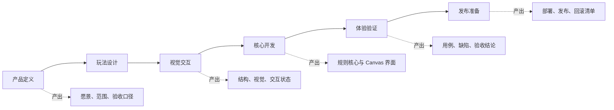
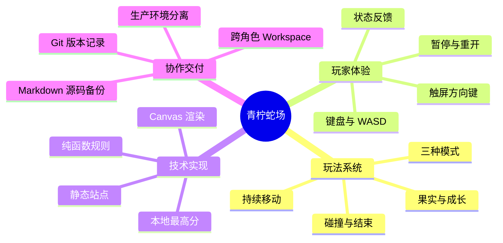

# 青柠蛇场制作启动展示交互

## 设计目标

在正式进入游戏前，用一个可点击的制作蓝图向成员与 Agent 解释青柠蛇场如何从产品定义走到发布准备。页面既是项目启动展示，也是产品、设计、研发、测试和运维之间的交接导航。

可运行页面：`snake-game/blueprint.html`

本地访问：`http://127.0.0.1:5173/snake-game/blueprint.html`

## 核心交互

- 点击“开始制作演示”后激活第一个制作阶段。
- 点击“进入下一阶段”沿产品、设计、开发、验证和发布顺序推进。
- 点击任意流程节点可以直接查看该阶段的负责人、产出和完成条件。
- 点击思维导图四条分支，可切换玩法、体验、技术和交付说明。
- 游戏首页提供“制作蓝图”入口，蓝图页提供“进入游戏”入口。
- 所有主要交互使用原生按钮或链接，支持键盘焦点与减少动态效果偏好。

## 制作流程图

## 项目思维导图

## 视觉方向

页面使用“制作工作台”概念：浅灰绿色网格纸承载内容，深云杉代表稳定的工程主线，青柠色只用于当前阶段和关键状态，琥珀色用于补充提示。唯一的强视觉元素是连接六个阶段的蛇形路线，其他区域保持克制。

## 响应式规则

- 宽屏：流程节点沿蛇形路径分布，思维导图以中心辐射方式展示。
- 窄屏：流程图转换为纵向阶段列表；思维导图转换为中心节点加四个纵向分支。
- 交互不依赖 hover；触屏和键盘都可以完成所有操作。

## 内容约定

- 流程阶段名称与 Workspace 专业空间保持一致。
- 页面文案描述真实产出，不使用占位词或营销话术。
- 玩法或工程边界变化时，同步更新交互页、本文档和相关产品/技术文档。
