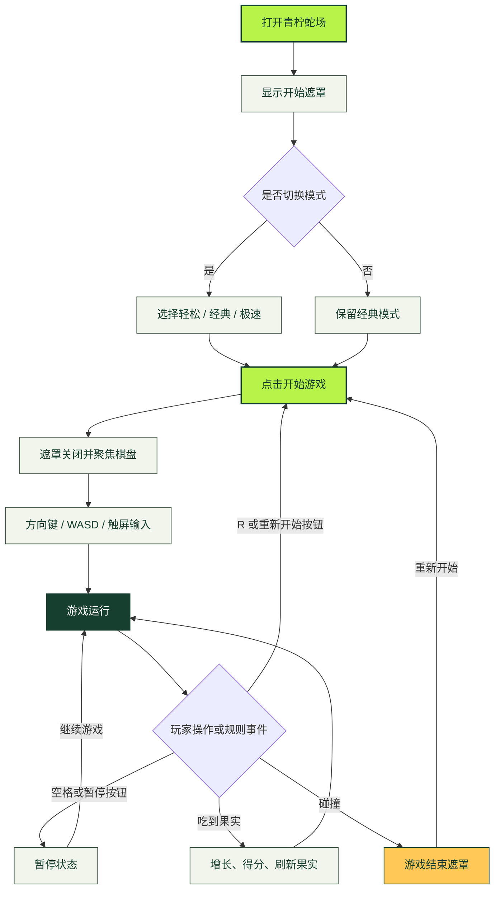
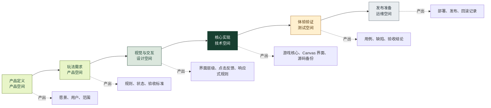
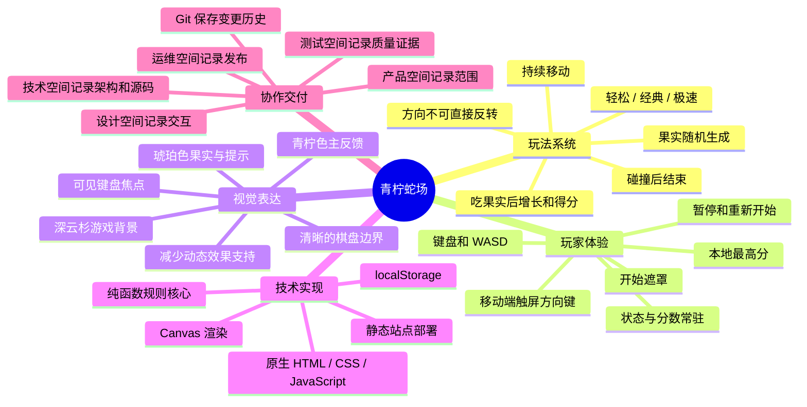

# 青柠蛇场制作流程与交互地图

## 文档目的

本文档是青柠蛇场在 Workspace 中的设计入口，用于统一游戏启动交互、跨角色制作流程和产品结构。流程图与思维导图直接保存在设计空间，不额外制作独立展示页面。

## 游戏开始交互

玩家进入游戏后，应在一个页面内完成模式选择、开始、方向控制、暂停和重新开始。每次点击都必须产生立即、明确且可恢复的状态反馈。

## 点击热区与反馈

| 交互入口 | 触发方式 | 即时反馈 | 进入状态 |
| --- | --- | --- | --- |
| 模式选择 | 点击下拉选项 | 模式名称与最高分立即刷新 | 等待开始 |
| 开始游戏 | 点击主按钮 | 遮罩消失、棋盘获得焦点、状态灯亮起 | 运行中 |
| 方向控制 | 方向键、WASD、触屏按钮 | 下一移动步改变方向 | 运行中 |
| 暂停游戏 | 空格或暂停按钮 | 棋盘停止推进，按钮文字变为继续 | 已暂停 |
| 继续游戏 | 空格或继续按钮 | 计时恢复，状态文字更新 | 运行中 |
| 重新开始 | `R` 或重新开始按钮 | 分数和蛇身重置，重新进入当前模式 | 运行中 |
| 游戏结束 | 发生碰撞 | 显示本局结果和重开入口 | 已结束 |

## 跨角色制作流程

下图描述项目从需求形成到正式环境交付的顺序。每个阶段的产出写入对应 Workspace 空间，Git 保存代码与文档变化历史。

## 项目思维导图

## 界面状态说明

### 等待开始

- 棋盘可见但不移动。
- 遮罩说明控制方式与当前模式。
- “开始游戏”是唯一主操作。

### 运行中

- 遮罩关闭，棋盘成为视觉焦点。
- 实时显示分数、最高分、等级与运行状态。
- 暂停按钮可用，重新开始保持次级层级。

### 已暂停

- 停止游戏循环，不改变蛇身和分数。
- 明确显示“已暂停”和“继续游戏”。
- 页面从后台恢复时不自动继续，避免意外失败。

### 游戏结束

- 显示失败原因、本局得分和最高分。
- 主操作切换为“再来一局”。
- 仍允许先切换游戏模式再重新开始。

## 设计约束

- 不用纯颜色区分状态，颜色必须配合文字或控件状态。
- 所有点击目标均提供键盘操作和可见焦点。
- 移动端方向按钮不得遮挡棋盘与得分信息。
- 点击之后的按钮名称、状态文案和视觉反馈使用一致词汇。
- 流程或玩法变化时，先更新本文档，再同步对应产品、技术、测试或运维记录。
